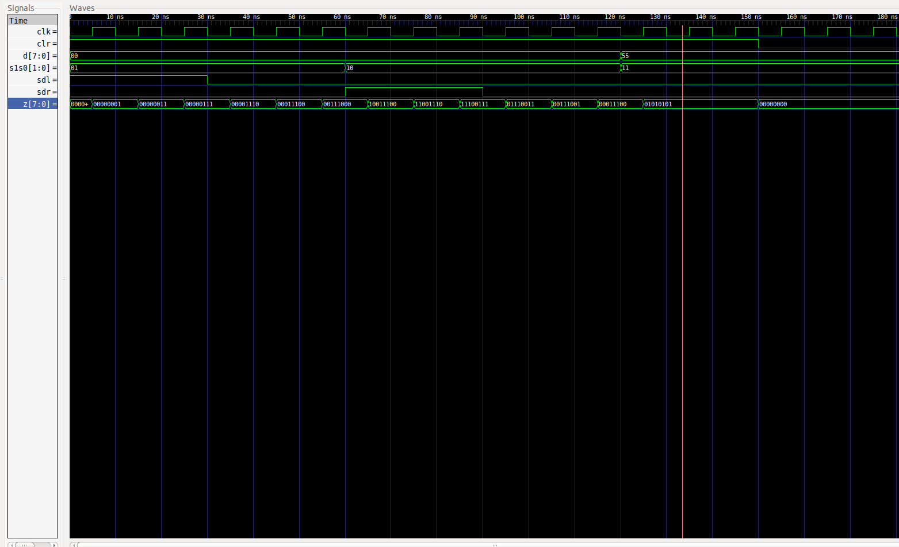

# DIGITAL_SYSTEMS 
## José Cisneros

### Code
#### [e_74194](e_74194.vhdl)
#### [e_8bitShiftRegister](e_8bitShiftRegister.vhdl)

### Run Code & Simulation
#### 8bits Bidirectional ShiftRegister
#### [bash run.sh](run.sh)

### Simulation
#### 8bits Bidirectional ShiftRegister
##### [e_8bitShiftRegister_tb](e_8bitShiftRegister_tb.vhdl)

