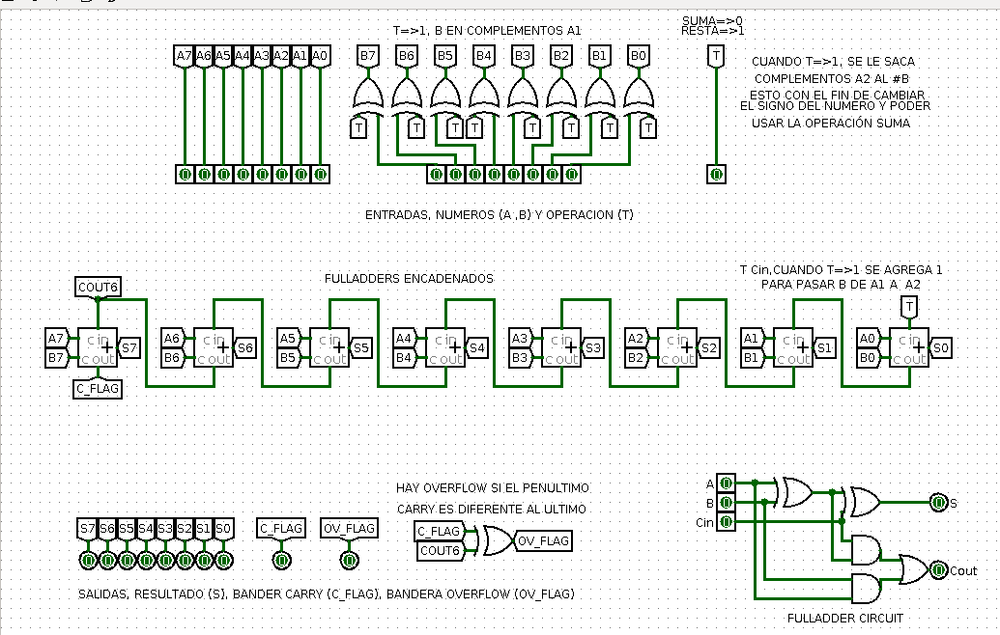
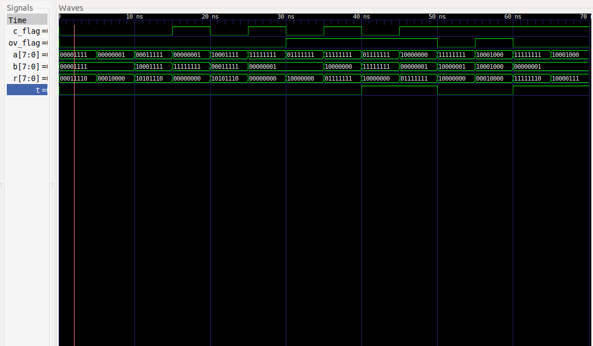

# DIGITAL_SYSTEMS 
## José Cisneros

### Schematic
#### [Logisim File](schematic.circ)

### Code
#### [Full_Adder](Full_A.vhdl)
#### [Adder/Substractor](addsub.vhdl)
#### [Adder/Substractor TestBench](addsub_tb.vhdl)

### Run Code & Simulation
#### [bash run.sh](run.sh)

### Simulation

