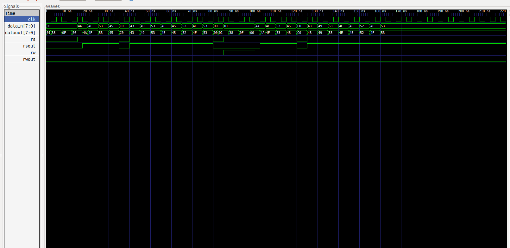
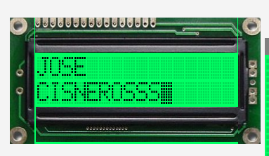

# DIGITAL_SYSTEMS 
## José Cisneros

### Code
#### [LCD](LCD.vhdl)
#### [LCD_tb](LCD_tb.vhdl)

### Run Code & Simulation
#### LCD Controller
#### [bash run.sh](run.sh)

### Simulation
#### LCD Controller
#### [Input](input.txt)
#### [Output](output.txt)
##### [LCD TestBench](LCD_tb.vhdl)

