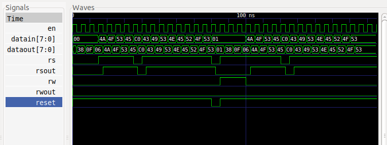
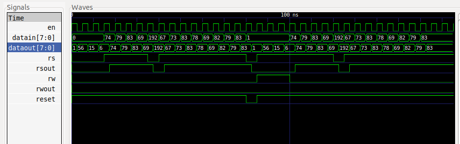

# DIGITAL_SYSTEMS 
## José Cisneros

### Code
#### [LCD](LCD.vhdl)
#### [LCD_tb](LCD_tb.vhdl)

### Run Code & Simulation
#### LCD Controller
#### [bash run.sh](run.sh)

### Simulation
#### LCD Controller
#### [Input](input.txt)
#### [Output](output.txt)
##### [LCD TestBench](LCD_tb.vhdl)

## Controller Operation
### As you can see in the image below, in this controller the dataIn, rs and rw signals are not the same as the controller outputs at all times. There are two cases in which this is not respected, when the controller has just been turned on and is initializing, or when it had a reset input in low. Both can be seen in the image.  

### And when the initialization process is not running. the input is equal to the output since these are equalized in the clock transitions. At each clock transition, the output vector is being written to the output file regardless of whether it has changed or not, as is the example of the last 3 ticks of the simulation. This was thought in order to take into account the cases in which you want to send the same character several times in a row.  
### [Output](output.txt)

### Among other relevant information to understand how the output file is written, if rs = '0' it is known that it is being written in the instruction register, if it is equal to 1, data is being sent as such. And they are changed to integer so that it is interpreted well by javascript in the page simulator:  
### instr (int) or data (int) depending on the record you are writing to.   
### https://www.bobtech.ro/tutoriale/componente-electronice/57-lcd-16x2-simulator

