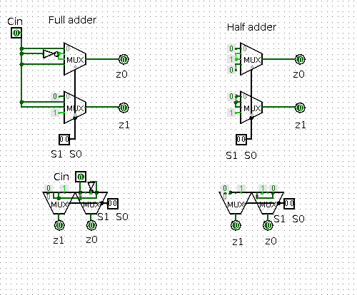
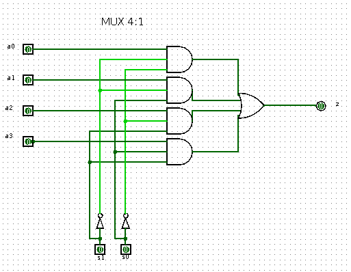
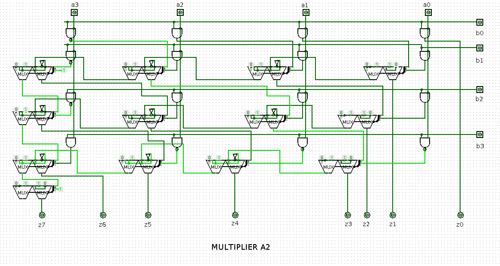
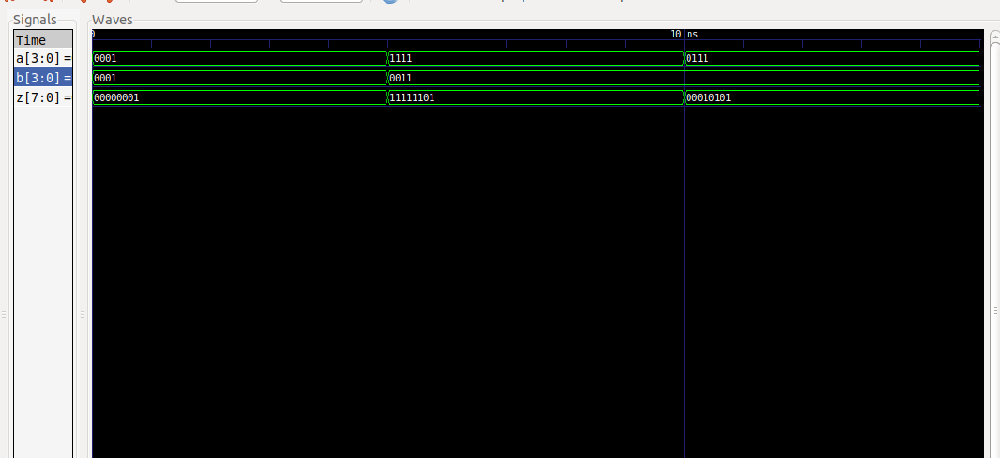

# DIGITAL_SYSTEMS 
## José Cisneros

### Schematic
#### [Adders](schematics/Adders.circ)

#### [Mux4:1](schematics/Multiplexor4_1.circ)

#### [Multiplier](schematics/Multiplicdor4_4_A2.circ)

### Code
#### [Half Adder](Half_A.vhdl)
#### [Full Adder](Full_A.vhdl)
#### [Full Adder TestBench](Full_A_tb.vhdl)
#### [Multiplexor4_1](Multiplexor4_1.vhdl)
#### [Multiplexor4_1 TestBench](Multiplexor4_1_tb.vhdl)
#### [Multiplier](Multiplier.vhdl)
#### [Multiplier TestBench](Multiplier_tb.vhdl)

### Run Code & Simulation
#### [bash run.sh](run.sh)

### Simulation

