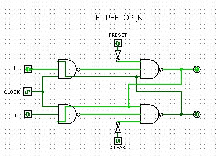
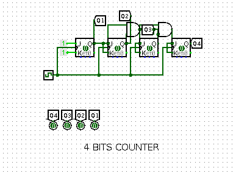
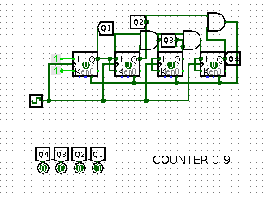
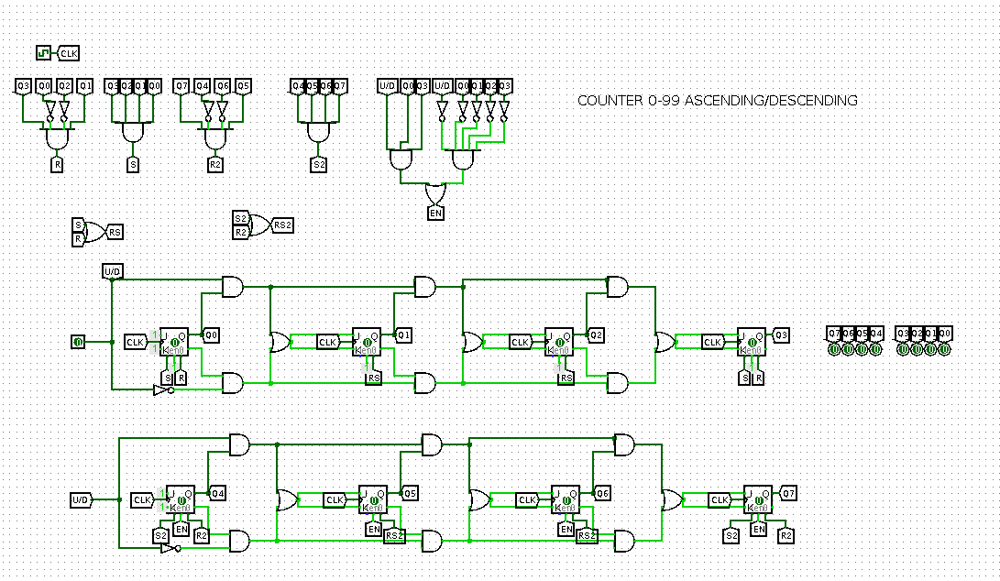
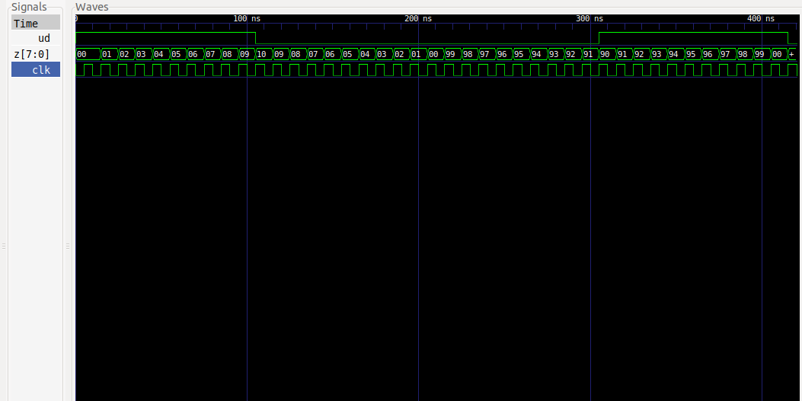

# DIGITAL_SYSTEMS 
## José Cisneros

### Schematic
#### [FlipFlop JK](schematics/flipflopjk.circ)

#### [4 Bits Counter](schematics/contador4bits.circ)

#### [0-9 Counter](schematics/contadordecadas.circ)

#### [0-99 Counter Ascending/Descending](schematics/contador0_99.circ)

### Code
#### [FF_JK](FF_JK.vhdl)
#### [FF_JK TestBench](FF_JK_tb.vhdl)
#### [Counter4B](Counter4B.vhdl)
#### [Counter4B TestBench](Counter4B_tb.vhdl)
#### [Counter4B UpDown](Counter4B_UD.vhdl)
#### [Counter4B UpDown TestBench](Counter4B_UD_tb.vhdl)
#### [Counter09](CounterD.vhdl)
#### [Counter09 TestBench](CounterD_tb.vhdl)
#### [Counter09 UpDown](CounterD_UD.vhdl)
#### [Counter09 UpDown TestBench](CounterD_UD_tb.vhdl)
#### [Counter99](Counter99.vhdl)
#### [Counter99 TestBench](Counter99_tb.vhdl)

### Run Code & Simulation
#### [bash run.sh](run.sh)

### Simulation

