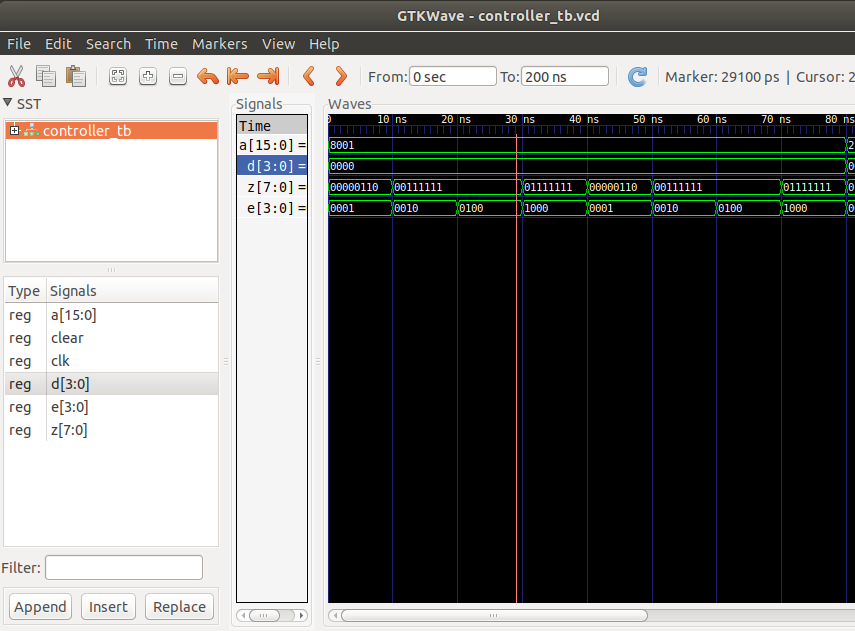
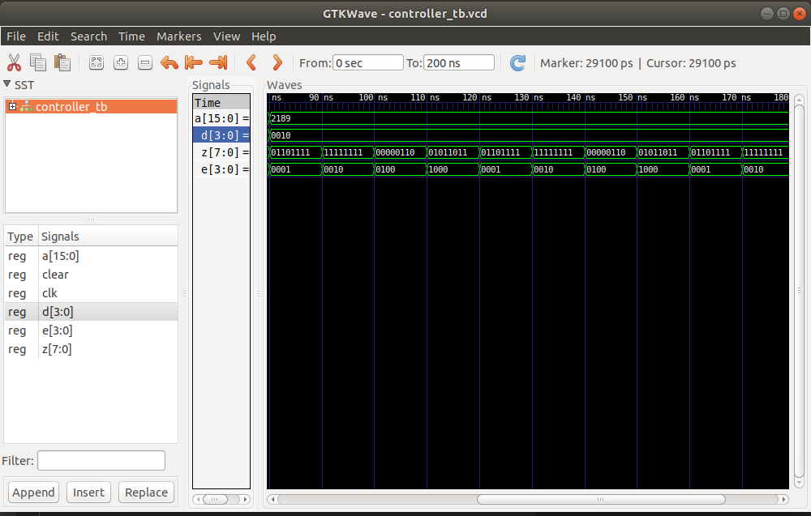

# DIGITAL_SYSTEMS 
## José Cisneros

### Schematic
#### [Decoder7](schematics/decoder7segmentos.circ)

#### [Controller](schematics/3display7segmentos.circ)

### Code
#### [FlipFlop JK](FF_JK.vhdl)
#### [Counter2B](Counter2B.vhdl)
#### [Multiplexor4_1](Multiplexor4_1.vhdl)
#### [Decoder7](decoder7.vhdl)
#### [Controller](controller.vhdl)
#### [Controller TestBench](controller_tb.vhdl)

### Run Code & Simulation
#### [bash run.sh](run.sh)

### Simulation
**Output:** E and Z(DP,G,F,E,D,C,B,A)
#### Simulation 1
**Input:** 
A<="1000000000000001";
D<="0000";
  

#### Simulation 2
**Input:**
A<="0010000110001001";
D<="0010";

