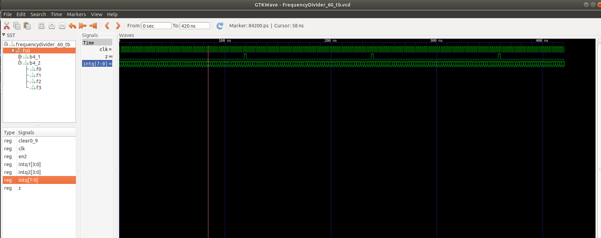

# DIGITAL_SYSTEMS 
## José Cisneros

### Schematic
#### [Frequency Divider Mod 60](schematics/FrequencyDivider.circ)

#### [Counter1_12](schematics/Counter1_12.circ)

### Code
#### [FlipFlop JK](FF_JK.vhdl)
#### [Counter4B](Counter4B.vhdl)
#### [Counter 0-9](Counter0_9.vhdl)
#### [Counter 1-12](Counter1_12.vhdl)
#### [FrequencyDivider MOD 60](FrequencyDivider_60.vhdl)

### Run Code & Simulation
#### Counter 1 to 12
#### [bash run1.sh](run1.sh)
#### Frequency Divider MOD 60
#### [bash run2.sh](run2.sh)

### Simulation
#### Counter 1 to 12

#### Counter FrequencyDivider Mod 60

