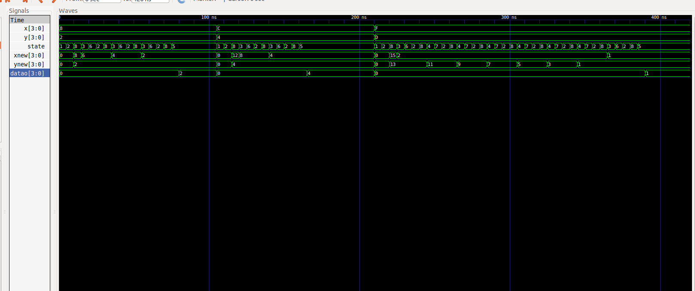

# DIGITAL_SYSTEMS 
## José Cisneros

## Code
### DataPath
#### [datapath](datapath.vhdl)
#### [comparator](comparator.vhdl)
#### [mux](mux.vhdl)
#### [mux_tb](mux_tb.vhdl)
#### [ffd](ffd.vhdl)
#### [register4bits](register4bits.vhdl)
#### [register4bits_tb](register4bits_tb.vhdl)
#### [substractor](substractor.vhdl)
#### [substractor4bits_tb](substractor4bits_tb.vhdl)
#### [substractor4bits](substractor4bits.vhdl)
### Controller
#### [controller](controller.vhdl)
### Integration
### [GDC_tb](GDC_tb.vhdl)
### [GDC](GDC.vhdl)

### Run Code
#### Integration
#### [bash run.sh](run.sh)

### Simulation
#### Integration GDC Calculator
##### [GDC_tb](GDC_tb.vhdl)
##### In the image you can see the steps of the operations in newy and newx and you can also see the changes in the state machine.

