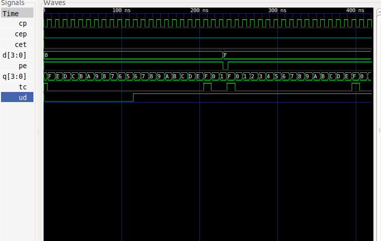

# DIGITAL_SYSTEMS 
## José Cisneros

### Code
#### [e_74F169](e_74F169.vhdl)
#### [e2_74F169](e2_74F169.vhdl)

### Run Code & Simulation
#### 74F169  
#### [bash run2.sh](run2.sh)
#### Counter in BCD 0 to 99 UP/DOWN
#### [bash run.sh](run.sh)

### Simulation
#### Counter 74F169 0 to F UP/DOWN
##### [e_74F169_tb](e_74F169_tb.vhdl)

#### Counter in BCD 0 to 99 UP/DOWN
##### [e2_74F169_tb](e2_74F169_tb.vhdl)

