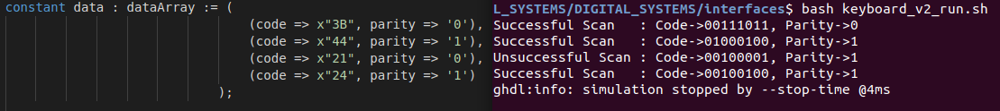
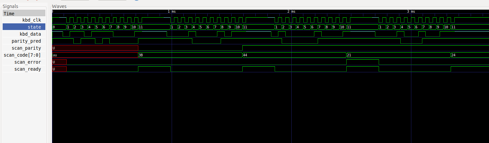
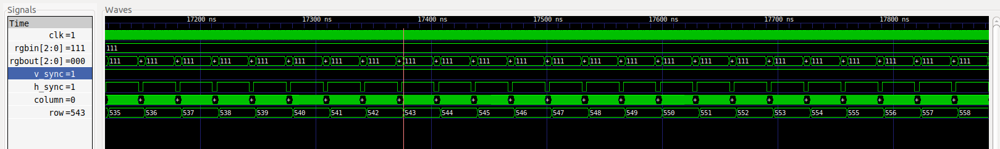

# DIGITAL_SYSTEMS 
## José Cisneros

## Code - Keyboard PS/2
### Keyboard PS/2 Version 1 : Implementation done in class. 
#### [Keyboard v1](keyboard_v1.vhdl)
#### [Keyboard v1 TB](keyboard_v1_tb.vhdl)
### Keyboard PS/2 Version 2 : Implementation with state machine.
#### [Keyboard v2](keyboard_v2.vhdl)
#### [Keyboard v2 TB](keyboard_v2_tb.vhdl)

## Code - VGA
#### [VGA](vga.vhdl)
#### [VGA TB](vga_tb.vhdl)
#### [VGA Pixel Generation](vga_pixel_generation.vhdl)
#### [VGA Sync](vga_sync.vhdl)

## Run Code
### Keyboard PS/2 Version 1
#### [bash keyboard_v1_run.sh](keyboard_v1_run.sh)
### Keyboard PS/2 Version 2
#### [bash keyboard_v2_run.sh](keyboard_v2_run.sh)
### VGA
#### [bash vga_run.sh](vga_run.sh)

## Simulation
### Keyboard PS/2 Version 2 with Error Detection Test

### VGA

